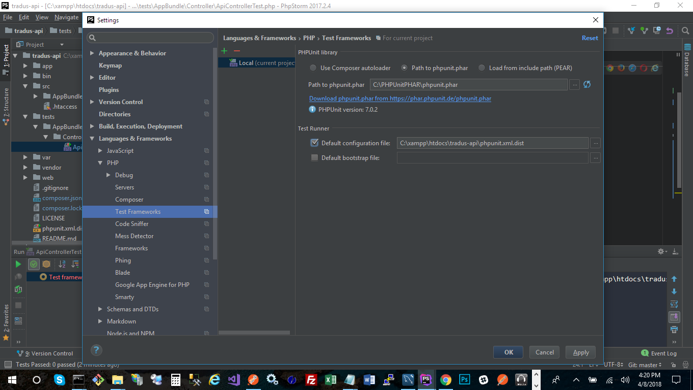
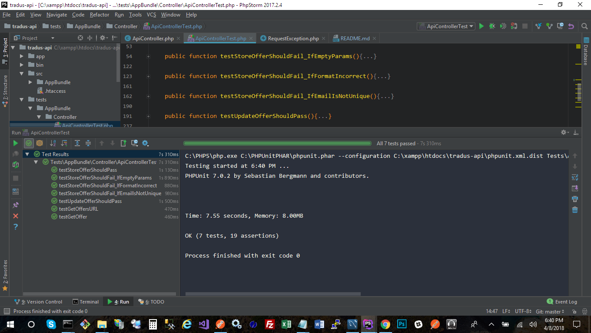

Api for Offers @Tradus
========================

This REST API will allow you to perform all the CRUD methods with the Offer Object.

For the environment of this API, I used the address: [127.0.0.1:8001][1]

Offer's Table Specs
--------------

All the fillable fields are required:

* id: int AI. | not fillable | PRIMARY KEY
* title: string(80) | not null | required
* description: string(255) | not null | required
* email: string(80) | not null | unique | email format | required
* image: string(255) | not null | url format | required
* created_at: date | not fillable

REST Methods
--------------

  * [**Get All Offers**][1]  Verb: GET [/offers][1]
  
    Returns all Offers in the table Offer.
  
    **Error Handler:**
  
    **404** - if there are no Offers.
  
    
  * [**Search Offers**][1]  Verb: GET [/search/offers/{search}][1]
    
    Returns all Offers that matches (LIKE), the param **search** against "title", "description" or "email".
    
          @param search is a string
    
    **Error Handler:**
    
    **404** - if there are no Offers that matches the search.  
  
  
  * [**Get One Offer**][1]  Verb: GET [/offers/{id}][1]
      
    Returns the Offer if found with the "id" of @param id.
      
            @param id is an int
    
    Note: this URL should have been [/offer/{id}][1]  (in singular), so the search url could be: [/offers/search/{search}][1]
      
    **Error Handler:**
      
    **404** - if there are no Offers that matches the id.  
  
  
  * [**Store Offer**][1]  Verb: POST [/offer][1]
        
      Stores the Offer.
      
      Returns status of **200** on Success.
        
      **Error Handler:**
        
      **406** - if there is an empty parameter (view table's Specs for fillable - required fields), or if the parameters doesn't comply with the format.

  * [**Update Offer**][1]  Verb: PUT [/offers/id][1]
        
      Updates the Offer, if found with the "id" of @param id.
            
           @param id is an int
      
      Returns status of **200** on Success.
      
      Note: this URL should have been [/offer/{id}][1]  (in singular)
        
      **Error Handler:**
      
      **404** - if there are no Offer with "id" = @param id.
      
      **406** - if there is an empty parameter (view table's Specs for fillable - required fields), or if the parameters doesn't comply with the format.

  * [**Delete Offer(s)**][1]  Verb: DELETE [/offers/id][1]
        
      Delete the Offer(s) if found with the "id" of @param id.
            
           @param offers is json in format: [{"id":1}, {"id":3}]
      Returns status of **200** on Success.
              
      **Error Handler:**
      
      **406** - if there parameter is empty
      
      **404** - if there is no match against the all id's.

Unit Testing
--------------

The tests were performed against the API, instead of a Mockup API. This approach will lead to multiple insertions into the database.

## PHP Storm Configuration for Unit Testing ##

Here is the configuration for PHP Storm

## Results for the Testings ##

## Getting the Requests for Postman:

References
--------------
* [What is Symfony][2]
* [Course 3: Talking to a MySQL Database in PHP][3]
* [How To Create Simple REST API In Symfony 3.1][4]

[1]:    https://void.com/
[2]:    https://symfony.com/
[3]:    https://knpuniversity.com/screencast/php-ep3
[4]:    https://www.cloudways.com/blog/rest-api-in-symfony-3-1/

    @Work Made By Richard Reveron 2018 for Tradus.

